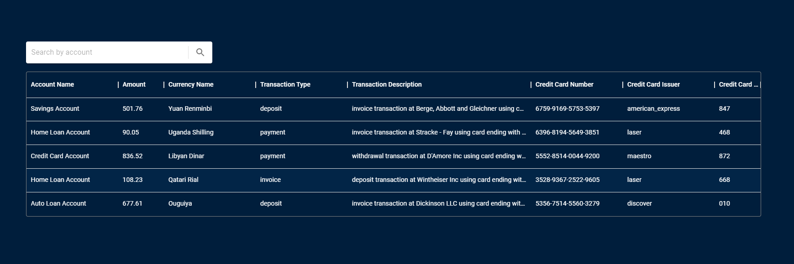
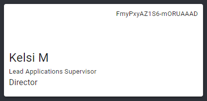

# Code Challange

This project was bootstrapped with [Create React App](https://github.com/facebook/create-react-app).

## Challenge Description

The challenge is to create two different routes inside the application “/table” and “/user” where:

"/table":

- You should be able to create a table and present the data coming from the backend in realtime. Each new data that arrives must be inserted into the table.
- The candidate must create a search input on the same page that will filter this information within the table.

An example that you can use for guidance:

<p>
     
</p>

"/user":

- The candidate must create a card presenting the information of the user logged into the server.

An example that you can use for guidance:

<p>
    
</p>

### Must to have:

- Use [Material-ui v5](https://mui.com/) for construct your components.

- [React/hooks](https://reactjs.org/docs/hooks-intro.html)

- On the day of the interview, have a project running on your machine to present.

## Additional information

The backend was built so you can use it as a data source, the client will be connected to the socket in real time. You will receive at an interval of 0 to 10 seconds a new request with financial data and you should use this information to build the table.

JSON schema for market data:

```json
{
  "account_name": "Personal Loan Account",
  "amount": "890.86",
  "credit_card_cvv": "248",
  "credit_card_issuer": "maestro",
  "credit_card_number": "6370-9605-9936-9733",
  "currency_name": "Pataca",
  "transaction_description": "payment transaction at Greenfelder",
  "transaction_type": "withdrawal"
}
```

JSON schema for client connected:

```json
{
  "client_id": "irZP2T8dsRl1kpCnAAAB",
  "first_name": "Otilia",
  "job": "Forward Accounts Strategist",
  "job_descriptor": "Regional"
}
```

## Available Scripts

In the project directory, you can run:

### `npm start`

Runs the app in the development mode.\
Open [http://localhost:3000](http://localhost:3000) to view it in your browser.

### `npm run server`

Launches the realtime server for provide data.\
Open [http://localhost:3003](http://localhost:3003) to get json response.

### `npm test`

Launches the test runner in the interactive watch mode.
